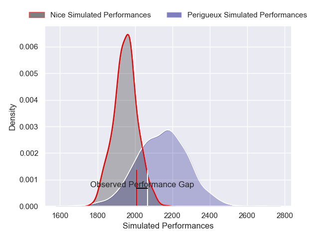
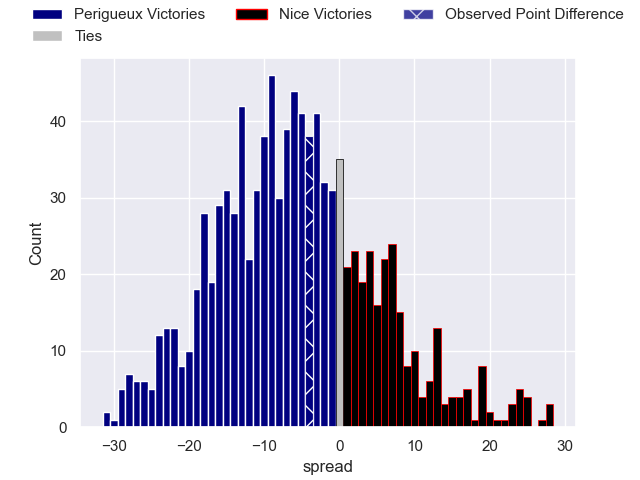

---  
layout: page  
title: Périgueux V Nice on 2025/08/29  
date: 2025-08-29  
categories: "Nationale 25/26" match projection  
---
# Périgueux V Nice on 2025/08/29, 19.0 to 15.0

# Club Level Predictions

Now that the game has been played, lets see how the club predictions did. I predicted Perigueux to win by 5.83, and Perigueux won by 4.0. That's an absolute error of 1.8 for the margin of victory, while my average absolute error has been 14.5 over the past six months. This prediction was more accurate than 90.9% of my recent predictions.

For the Over/Under model, I predicted a total of 44.5 and we have an actual total of 34.0. That's an absolute error of 10.5 compared to a six month average of 13.8. This prediction was more accurate than 53.3% of my recent predictions.
## Projected Performances - Club Model

## Projected Spreads - Club Model

## Projected Results - Club Model

