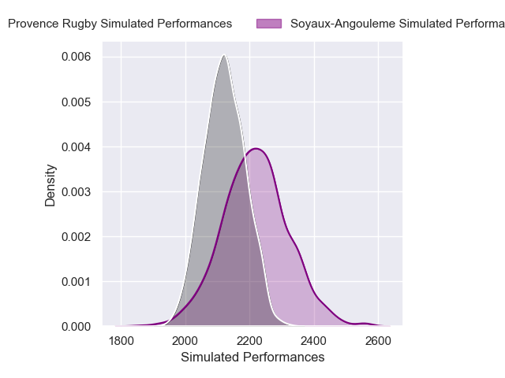
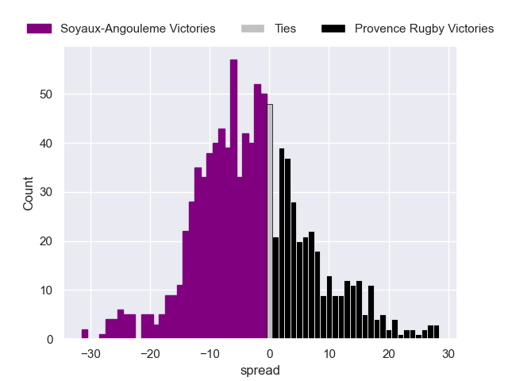

---  
layout: page  
title: Soyaux-Angouleme V Provence Rugby on 2025/08/29  
date: 2025-08-29  
categories: "Pro D2 25/26" match projection  
---
# Soyaux-Angouleme V Provence Rugby on 2025/08/29, 28.0 to 25.0

# Club Level Predictions

Now that the game has been played, lets see how the club predictions did. I predicted Soyaux-Angouleme to win by 2.61, and Soyaux-Angouleme won by 3.0. That's an absolute error of 0.4 for the margin of victory, while my average absolute error has been 14.6 over the past six months. This prediction was more accurate than 98.2% of my recent predictions.

For the Over/Under model, I predicted a total of 51.5 and we have an actual total of 53.0. That's an absolute error of 1.5 compared to a six month average of 14.0. This prediction was more accurate than 92.1% of my recent predictions.
## Projected Performances - Club Model

## Projected Spreads - Club Model

## Projected Results - Club Model

