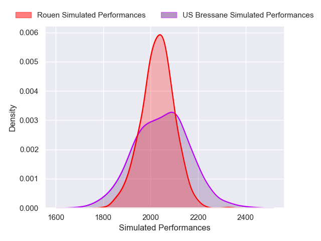
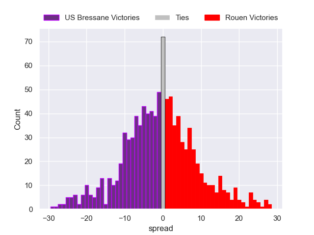

---  
layout: page  
title: US Bressane V Rouen on 2025/08/29  
date: 2025-08-29  
categories: "Nationale 25/26" match projection  
---
# US Bressane V Rouen on 2025/08/29, 18.0 to 18.0

# Club Level Predictions

Now that the game has been played, lets see how the club predictions did. I predicted US Bressane to win by 0.62, and Rouen won by 0.0. That's an absolute error of 0.6 for the margin of victory, while my average absolute error has been 14.6 over the past six months. This prediction was more accurate than 97.3% of my recent predictions.

For the Over/Under model, I predicted a total of 46.5 and we have an actual total of 36.0. That's an absolute error of 10.5 compared to a six month average of 14.0. This prediction was more accurate than 54.6% of my recent predictions.
## Projected Performances - Club Model

## Projected Spreads - Club Model

## Projected Results - Club Model

