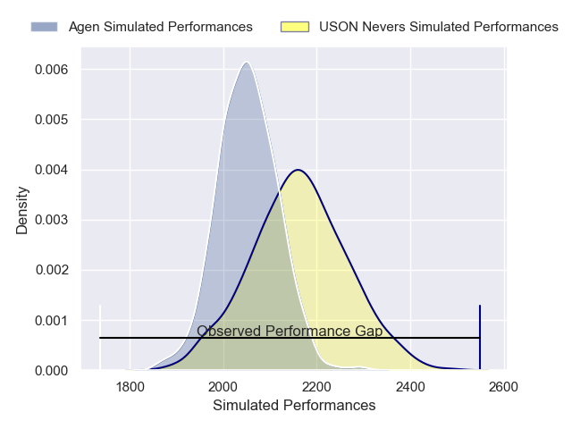
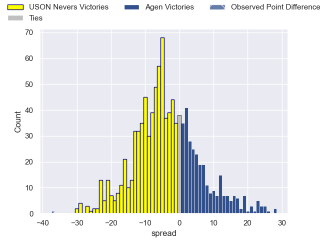

---  
layout: page  
title: USON Nevers V Agen on 2025/08/29  
date: 2025-08-29  
categories: "Pro D2 25/26" match projection  
---
# USON Nevers V Agen on 2025/08/29, 54.0 to 17.0

# Club Level Predictions

Now that the game has been played, lets see how the club predictions did. I predicted USON Nevers to win by 3.34, and USON Nevers won by 37.0. That's an absolute error of 33.7 for the margin of victory, while my average absolute error has been 14.6 over the past six months. This prediction was more accurate than 7.9% of my recent predictions.

For the Over/Under model, I predicted a total of 50.5 and we have an actual total of 71.0. That's an absolute error of 20.5 compared to a six month average of 14.0. This prediction was more accurate than 23.4% of my recent predictions.
## Projected Performances - Club Model

## Projected Spreads - Club Model

## Projected Results - Club Model

