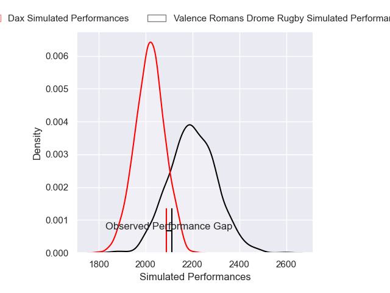
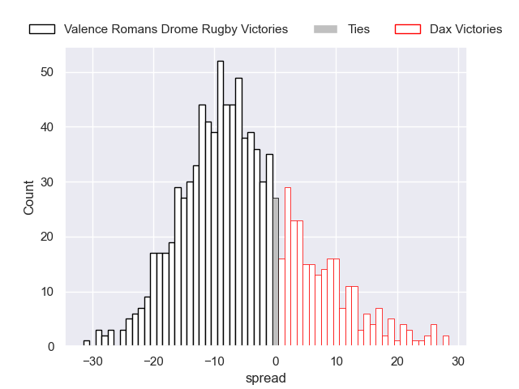
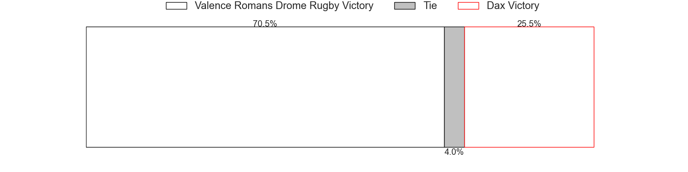

---  
layout: page  
title: Valence Romans Drome Rugby V Dax on 2025/08/29  
date: 2025-08-29  
categories: "Pro D2 25/26" match projection  
---
# Valence Romans Drome Rugby V Dax on 2025/08/29, 36.0 to 23.0

# Club Level Predictions

Now that the game has been played, lets see how the club predictions did. I predicted Valence Romans Drome Rugby to win by 4.43, and Valence Romans Drome Rugby won by 13.0. That's an absolute error of 8.6 for the margin of victory, while my average absolute error has been 14.6 over the past six months. This prediction was more accurate than 59.0% of my recent predictions.

For the Over/Under model, I predicted a total of 49.5 and we have an actual total of 59.0. That's an absolute error of 9.5 compared to a six month average of 14.0. This prediction was more accurate than 57.7% of my recent predictions.
## Projected Performances - Club Model

## Projected Spreads - Club Model

## Projected Results - Club Model

