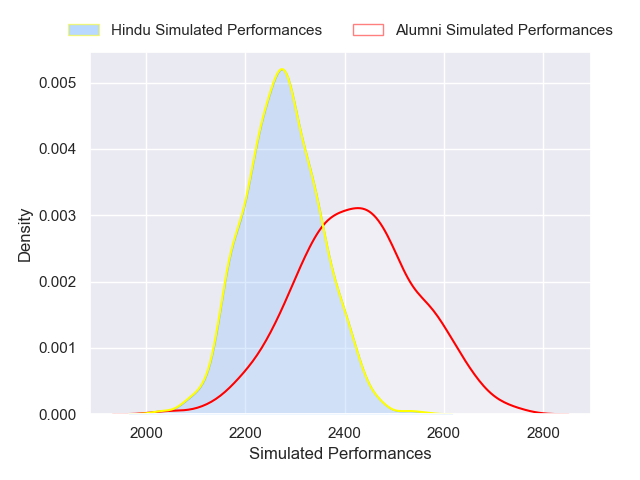
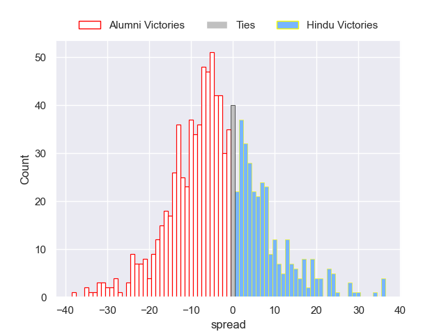

---  
layout: page  
title: Alumni V Hindu on 2025/08/30  
date: 2025-08-30  
categories: "URBA Top 13 2025" match projection  
---
# Alumni V Hindu on 2025/08/30, 24.0 to 23.0

# Club Level Predictions

Now that the game has been played, lets see how the club predictions did. I predicted Alumni to win by 1.57, and Alumni won by 1.0. That's an absolute error of 0.6 for the margin of victory, while my average absolute error has been 14.6 over the past six months. This prediction was more accurate than 97.3% of my recent predictions.

For the Over/Under model, I predicted a total of 50.5 and we have an actual total of 47.0. That's an absolute error of 3.5 compared to a six month average of 14.0. This prediction was more accurate than 84.1% of my recent predictions.
## Projected Performances - Club Model

## Projected Spreads - Club Model

## Projected Results - Club Model

