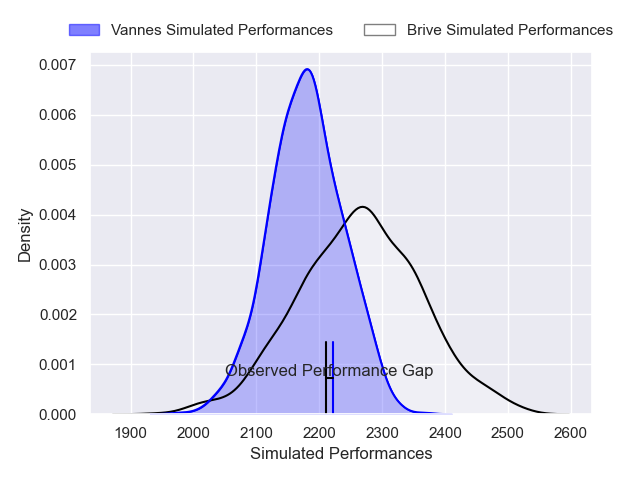
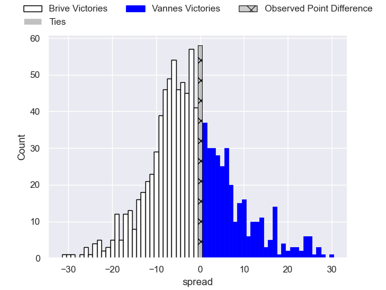
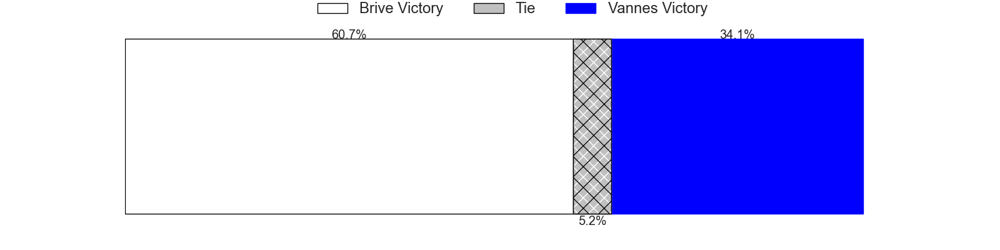

---  
layout: page  
title: Brive V Vannes on 2025/08/30  
date: 2025-08-30  
categories: "Pro D2 25/26" match projection  
---
# Brive V Vannes on 2025/08/30, 30.0 to 30.0

# Club Level Predictions

Now that the game has been played, lets see how the club predictions did. I predicted Brive to win by 2.12, and Vannes won by 0.0. That's an absolute error of 2.1 for the margin of victory, while my average absolute error has been 14.6 over the past six months. This prediction was more accurate than 89.1% of my recent predictions.

For the Over/Under model, I predicted a total of 53.5 and we have an actual total of 60.0. That's an absolute error of 6.5 compared to a six month average of 14.0. This prediction was more accurate than 69.9% of my recent predictions.
## Projected Performances - Club Model

## Projected Spreads - Club Model

## Projected Results - Club Model

