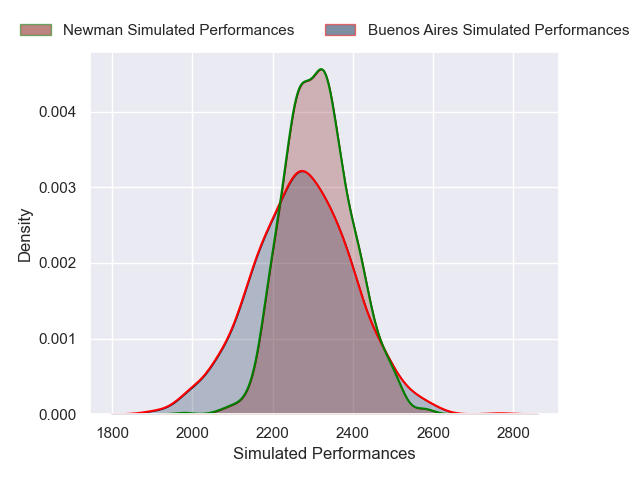
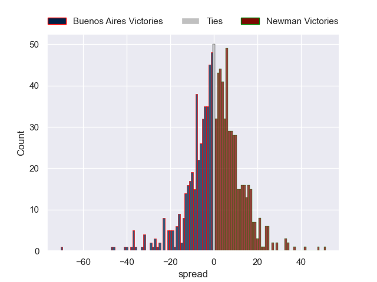

---  
layout: page  
title: Buenos Aires V Newman on 2025/08/30  
date: 2025-08-30  
categories: "URBA Top 13 2025" match projection  
---
# Buenos Aires V Newman on 2025/08/30, 10.0 to 32.0

# Club Level Predictions

Now that the game has been played, lets see how the club predictions did. I predicted Newman to win by 2.93, and Newman won by 22.0. That's an absolute error of 19.1 for the margin of victory, while my average absolute error has been 14.6 over the past six months. This prediction was more accurate than 26.7% of my recent predictions.

For the Over/Under model, I predicted a total of 55.5 and we have an actual total of 42.0. That's an absolute error of 13.5 compared to a six month average of 14.0. This prediction was more accurate than 41.9% of my recent predictions.
## Projected Performances - Club Model

## Projected Spreads - Club Model

## Projected Results - Club Model

