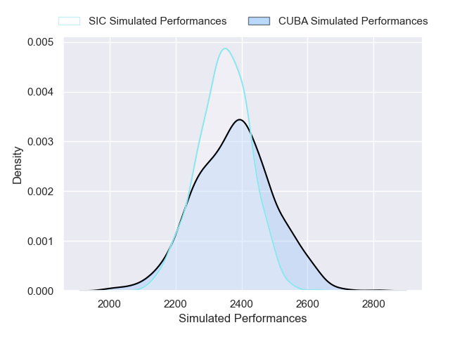
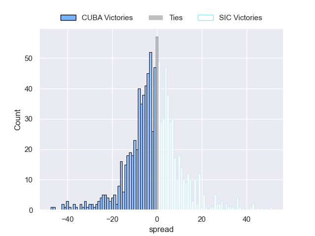

---  
layout: page  
title: CUBA V SIC on 2025/08/30  
date: 2025-08-30  
categories: "URBA Top 13 2025" match projection  
---
# CUBA V SIC on 2025/08/30, 34.0 to 38.0

# Club Level Predictions

Now that the game has been played, lets see how the club predictions did. I predicted CUBA to win by 0.02, and SIC won by 4.0. That's an absolute error of 4.0 for the margin of victory, while my average absolute error has been 14.6 over the past six months. This prediction was more accurate than 81.0% of my recent predictions.

For the Over/Under model, I predicted a total of 51.5 and we have an actual total of 72.0. That's an absolute error of 20.5 compared to a six month average of 14.0. This prediction was more accurate than 23.4% of my recent predictions.
## Projected Performances - Club Model

## Projected Spreads - Club Model

## Projected Results - Club Model

