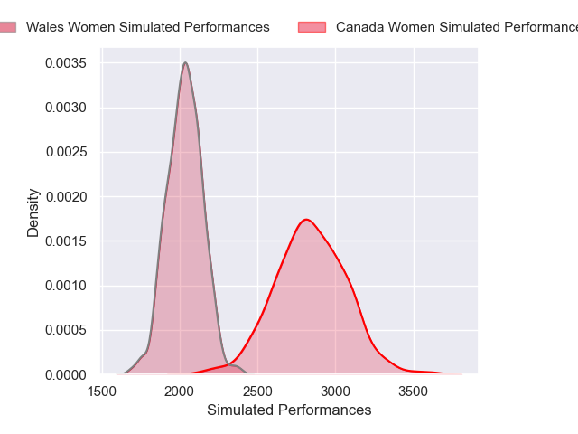
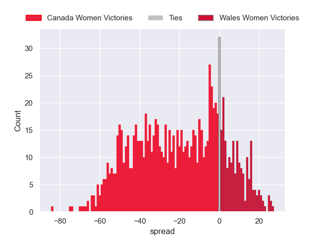
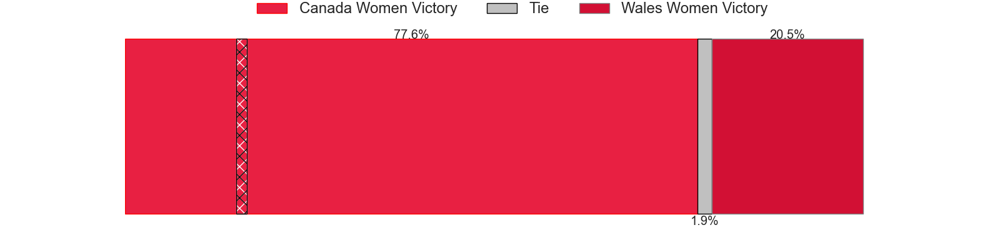

---  
layout: page  
title: Canada Women V Wales Women on 2025/08/30  
date: 2025-08-30  
categories: "Women's Rugby World Cup 2025" match projection  
---
# Canada Women V Wales Women on 2025/08/30, 42.0 to 0.0

# Club Level Predictions

Now that the game has been played, lets see how the club predictions did. I predicted Canada Women to win by 18.68, and Canada Women won by 42.0. That's an absolute error of 23.3 for the margin of victory, while my average absolute error has been 14.5 over the past six months. This prediction was more accurate than 18.0% of my recent predictions.

For the Over/Under model, I predicted a total of 58.5 and we have an actual total of 42.0. That's an absolute error of 16.5 compared to a six month average of 13.8. This prediction was more accurate than 32.4% of my recent predictions.
## Projected Performances - Club Model

## Projected Spreads - Club Model

## Projected Results - Club Model

