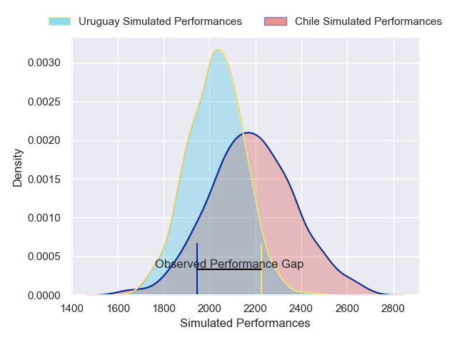

---  
layout: page  
title: Chile V Uruguay on 2025/08/30  
date: 2025-08-30  
categories: "International Test Match 2025" match projection  
---
# Chile V Uruguay on 2025/08/30, 16.0 to 28.0

# Club Level Predictions

Now that the game has been played, lets see how the club predictions did. I predicted Chile to win by 4.31, and Uruguay won by 12.0. That's an absolute error of 16.3 for the margin of victory, while my average absolute error has been 14.5 over the past six months. This prediction was more accurate than 33.3% of my recent predictions.

For the Over/Under model, I predicted a total of 51.5 and we have an actual total of 44.0. That's an absolute error of 7.5 compared to a six month average of 13.8. This prediction was more accurate than 65.7% of my recent predictions.
## Projected Performances - Club Model

## Projected Spreads - Club Model

## Projected Results - Club Model

