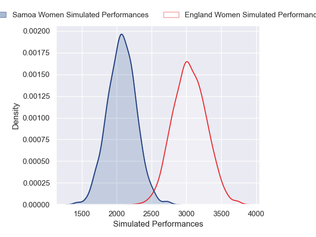
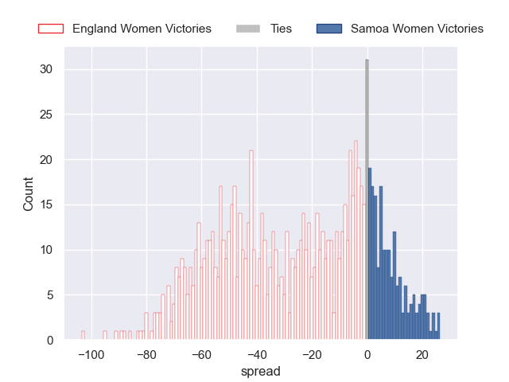

---  
layout: page  
title: England Women V Samoa Women on 2025/08/30  
date: 2025-08-30  
categories: "Women's Rugby World Cup 2025" match projection  
---
# England Women V Samoa Women on 2025/08/30, 92.0 to 3.0

# Club Level Predictions

Now that the game has been played, lets see how the club predictions did. I predicted England Women to win by 19.33, and England Women won by 89.0. That's an absolute error of 69.7 for the margin of victory, while my average absolute error has been 14.5 over the past six months. This prediction was more accurate than 0.9% of my recent predictions.

For the Over/Under model, I predicted a total of 53.5 and we have an actual total of 95.0. That's an absolute error of 41.5 compared to a six month average of 13.8. This prediction was more accurate than 3.0% of my recent predictions.
## Projected Performances - Club Model

## Projected Spreads - Club Model

## Projected Results - Club Model

