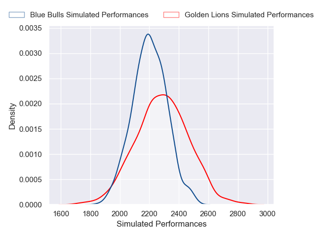
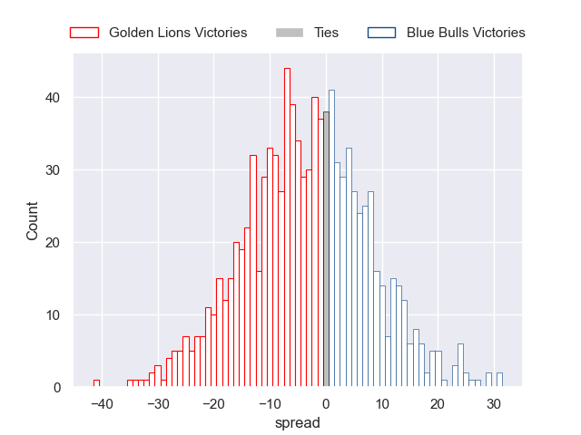

---  
layout: page  
title: Golden Lions V Blue Bulls on 2025/08/30  
date: 2025-08-30  
categories: "Currie Cup 2025" match projection  
---
# Golden Lions V Blue Bulls on 2025/08/30, 44.0 to 5.0

# Club Level Predictions

Now that the game has been played, lets see how the club predictions did. I predicted Golden Lions to win by 2.44, and Golden Lions won by 39.0. That's an absolute error of 36.6 for the margin of victory, while my average absolute error has been 14.6 over the past six months. This prediction was more accurate than 6.6% of my recent predictions.

For the Over/Under model, I predicted a total of 60.5 and we have an actual total of 49.0. That's an absolute error of 11.5 compared to a six month average of 14.0. This prediction was more accurate than 49.3% of my recent predictions.
## Projected Performances - Club Model

## Projected Spreads - Club Model

## Projected Results - Club Model

