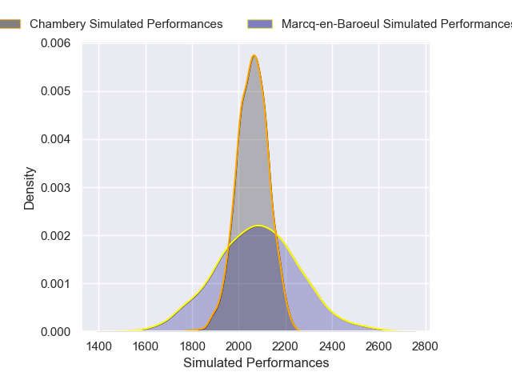
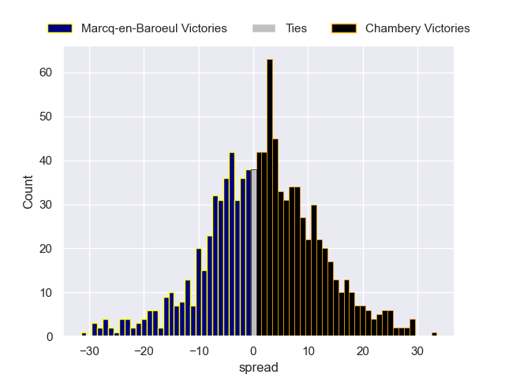

---  
layout: page  
title: Marcq-en-Baroeul V Chambery on 2025/08/30  
date: 2025-08-30  
categories: "Nationale 25/26" match projection  
---
# Marcq-en-Baroeul V Chambery on 2025/08/30, 19.0 to 17.0

# Club Level Predictions

Now that the game has been played, lets see how the club predictions did. I predicted Marcq-en-Baroeul to win by 0.62, and Marcq-en-Baroeul won by 2.0. That's an absolute error of 1.4 for the margin of victory, while my average absolute error has been 14.6 over the past six months. This prediction was more accurate than 93.0% of my recent predictions.

For the Over/Under model, I predicted a total of 48.5 and we have an actual total of 36.0. That's an absolute error of 12.5 compared to a six month average of 14.0. This prediction was more accurate than 45.4% of my recent predictions.
## Projected Performances - Club Model

## Projected Spreads - Club Model

## Projected Results - Club Model

