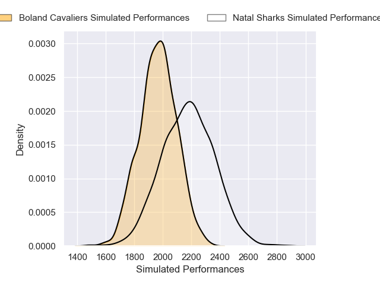
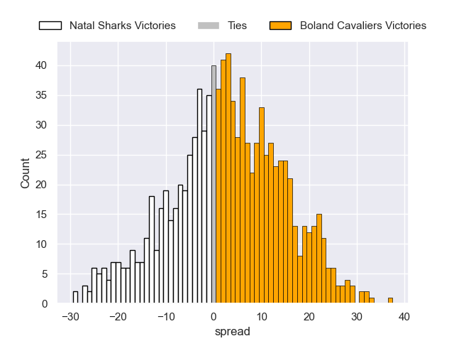

---  
layout: page  
title: Natal Sharks V Boland Cavaliers on 2025/08/30  
date: 2025-08-30  
categories: "Currie Cup 2025" match projection  
---
# Natal Sharks V Boland Cavaliers on 2025/08/30, 33.0 to 31.0

# Club Level Predictions

Now that the game has been played, lets see how the club predictions did. I predicted Natal Sharks to win by 7.09, and Natal Sharks won by 2.0. That's an absolute error of 5.1 for the margin of victory, while my average absolute error has been 14.6 over the past six months. This prediction was more accurate than 75.5% of my recent predictions.

For the Over/Under model, I predicted a total of 52.5 and we have an actual total of 64.0. That's an absolute error of 11.5 compared to a six month average of 14.0. This prediction was more accurate than 49.3% of my recent predictions.
## Projected Performances - Club Model

## Projected Spreads - Club Model

## Projected Results - Club Model

