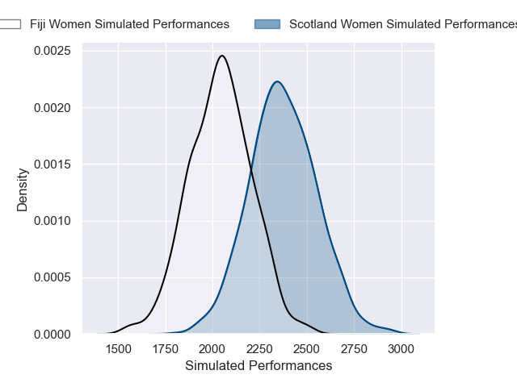
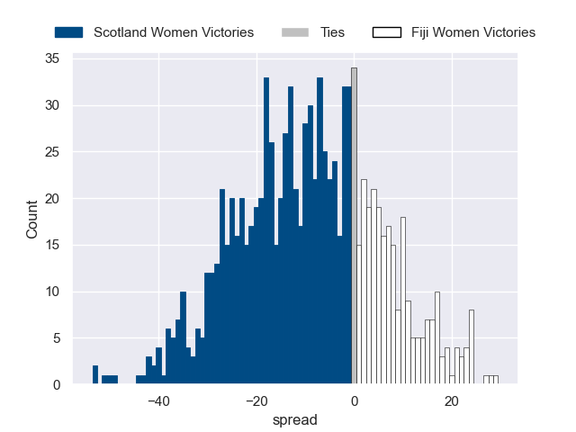

---  
layout: page  
title: Scotland Women V Fiji Women on 2025/08/30  
date: 2025-08-30  
categories: "Women's Rugby World Cup 2025" match projection  
---
# Scotland Women V Fiji Women on 2025/08/30, 29.0 to 15.0

# Club Level Predictions

Now that the game has been played, lets see how the club predictions did. I predicted Scotland Women to win by 10.95, and Scotland Women won by 14.0. That's an absolute error of 3.1 for the margin of victory, while my average absolute error has been 14.6 over the past six months. This prediction was more accurate than 85.5% of my recent predictions.

For the Over/Under model, I predicted a total of 54.5 and we have an actual total of 44.0. That's an absolute error of 10.5 compared to a six month average of 14.0. This prediction was more accurate than 54.0% of my recent predictions.
## Projected Performances - Club Model

## Projected Spreads - Club Model

## Projected Results - Club Model

