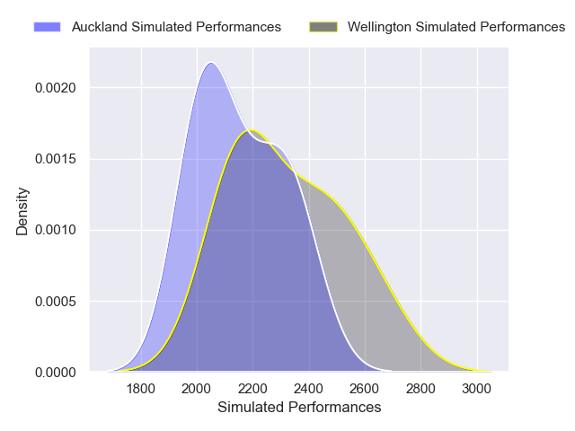
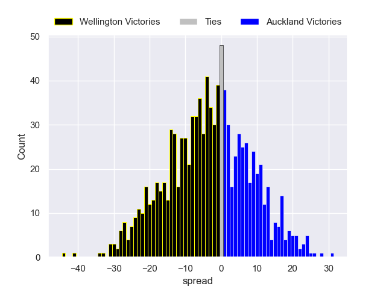

---  
layout: page  
title: Wellington V Auckland on 2025/08/30  
date: 2025-08-30  
categories: "NPC 2025" match projection  
---
# Wellington V Auckland on 2025/08/30, 36.0 to 17.0

# Club Level Predictions

Now that the game has been played, lets see how the club predictions did. I predicted Wellington to win by 5.48, and Wellington won by 19.0. That's an absolute error of 13.5 for the margin of victory, while my average absolute error has been 14.6 over the past six months. This prediction was more accurate than 40.3% of my recent predictions.

For the Over/Under model, I predicted a total of 53.5 and we have an actual total of 53.0. That's an absolute error of 0.5 compared to a six month average of 14.0. This prediction was more accurate than 98.2% of my recent predictions.
## Projected Performances - Club Model

## Projected Spreads - Club Model

## Projected Results - Club Model

