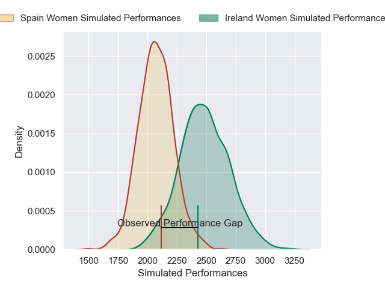
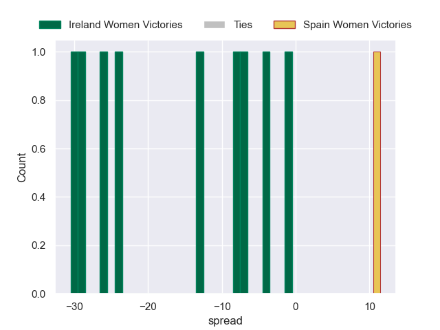

---  
layout: page  
title: Ireland Women V Spain Women on 2025/08/31  
date: 2025-08-31  
categories: "Women's Rugby World Cup 2025" match projection  
---
# Ireland Women V Spain Women on 2025/08/31, 43.0 to 27.0

# Club Level Predictions

Now that the game has been played, lets see how the club predictions did. I predicted Ireland Women to win by 11.87, and Ireland Women won by 16.0. That's an absolute error of 4.1 for the margin of victory, while my average absolute error has been 14.5 over the past six months. This prediction was more accurate than 80.1% of my recent predictions.

For the Over/Under model, I predicted a total of 57.5 and we have an actual total of 70.0. That's an absolute error of 12.5 compared to a six month average of 13.8. This prediction was more accurate than 44.3% of my recent predictions.
## Projected Performances - Club Model

## Projected Spreads - Club Model

## Projected Results - Club Model

