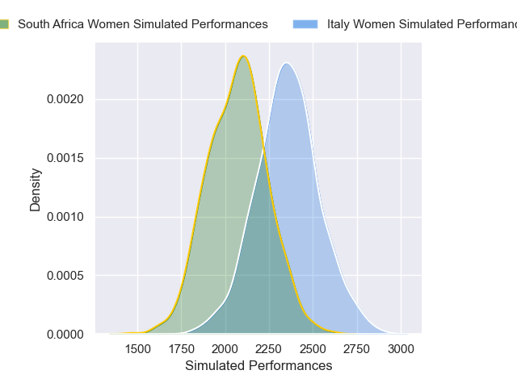
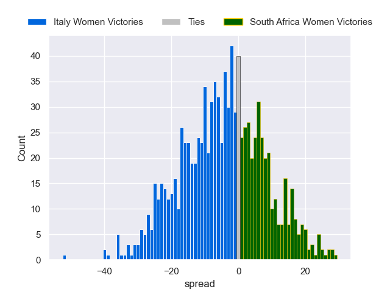

---  
layout: page  
title: Italy Women V South Africa Women on 2025/08/31  
date: 2025-08-31  
categories: "Women's Rugby World Cup 2025" match projection  
---
# Italy Women V South Africa Women on 2025/08/31, 24.0 to 29.0

# Club Level Predictions

Now that the game has been played, lets see how the club predictions did. I predicted Italy Women to win by 7.26, and South Africa Women won by 5.0. That's an absolute error of 12.3 for the margin of victory, while my average absolute error has been 14.5 over the past six months. This prediction was more accurate than 46.3% of my recent predictions.

For the Over/Under model, I predicted a total of 51.5 and we have an actual total of 53.0. That's an absolute error of 1.5 compared to a six month average of 13.8. This prediction was more accurate than 92.8% of my recent predictions.
## Projected Performances - Club Model

## Projected Spreads - Club Model

## Projected Results - Club Model

