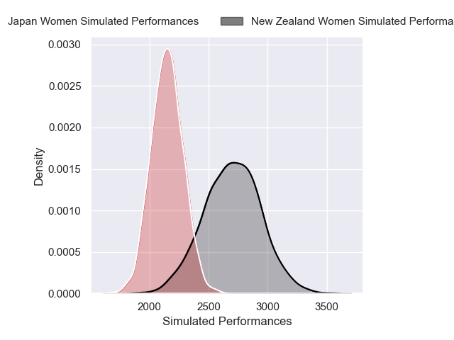
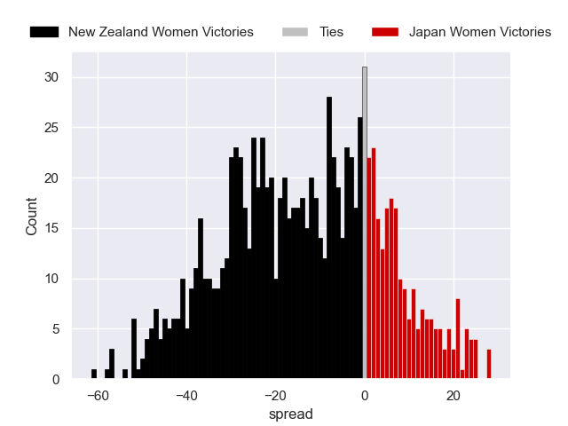

---  
layout: page  
title: New Zealand Women V Japan Women on 2025/08/31  
date: 2025-08-31  
categories: "Women's Rugby World Cup 2025" match projection  
---
# New Zealand Women V Japan Women on 2025/08/31, 62.0 to 19.0

# Club Level Predictions

Now that the game has been played, lets see how the club predictions did. I predicted New Zealand Women to win by 13.71, and New Zealand Women won by 43.0. That's an absolute error of 29.3 for the margin of victory, while my average absolute error has been 14.5 over the past six months. This prediction was more accurate than 10.8% of my recent predictions.

For the Over/Under model, I predicted a total of 54.5 and we have an actual total of 81.0. That's an absolute error of 26.5 compared to a six month average of 13.8. This prediction was more accurate than 12.6% of my recent predictions.
## Projected Performances - Club Model

## Projected Spreads - Club Model

## Projected Results - Club Model

