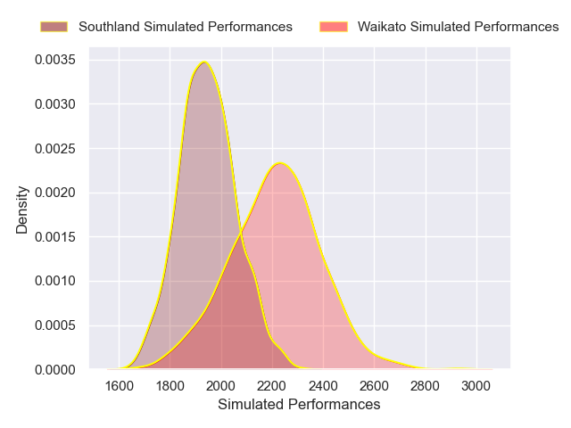
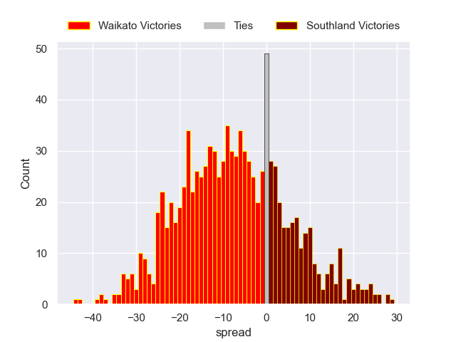

---  
layout: page  
title: Waikato V Southland on 2025/08/31  
date: 2025-08-31  
categories: "NPC 2025" match projection  
---
# Waikato V Southland on 2025/08/31, 10.0 to 25.0

# Club Level Predictions

Now that the game has been played, lets see how the club predictions did. I predicted Waikato to win by 9.98, and Southland won by 15.0. That's an absolute error of 25.0 for the margin of victory, while my average absolute error has been 14.6 over the past six months. This prediction was more accurate than 16.6% of my recent predictions.

For the Over/Under model, I predicted a total of 53.5 and we have an actual total of 35.0. That's an absolute error of 18.5 compared to a six month average of 14.0. This prediction was more accurate than 28.8% of my recent predictions.
## Projected Performances - Club Model

## Projected Spreads - Club Model

## Projected Results - Club Model

