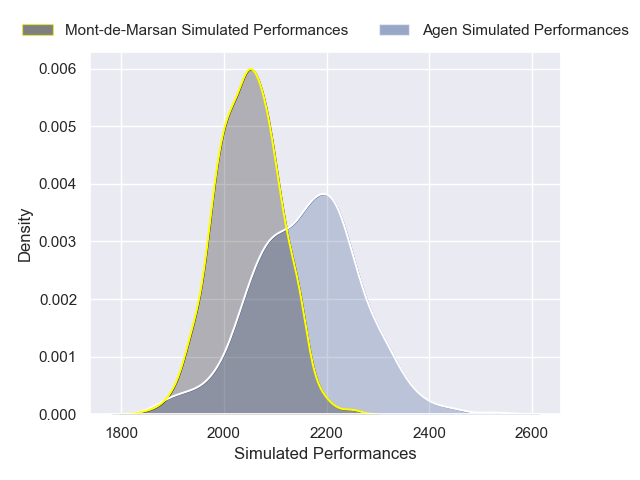
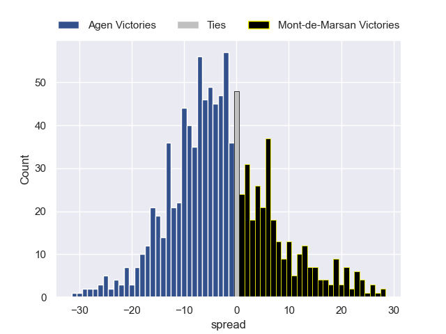

---  
layout: page  
title: Agen V Mont-de-Marsan on 2025/09/05  
date: 2025-09-05  
categories: "Pro D2 25/26" match projection  
---
# Agen V Mont-de-Marsan on 2025/09/05, 53.0 to 7.0

# Club Level Predictions

Now that the game has been played, lets see how the club predictions did. I predicted Agen to win by 3.5, and Agen won by 46.0. That's an absolute error of 42.5 for the margin of victory, while my average absolute error has been 14.6 over the past six months. This prediction was more accurate than 4.4% of my recent predictions.

For the Over/Under model, I predicted a total of 47.5 and we have an actual total of 60.0. That's an absolute error of 12.5 compared to a six month average of 13.8. This prediction was more accurate than 44.5% of my recent predictions.
## Projected Performances - Club Model

## Projected Spreads - Club Model

## Projected Results - Club Model

