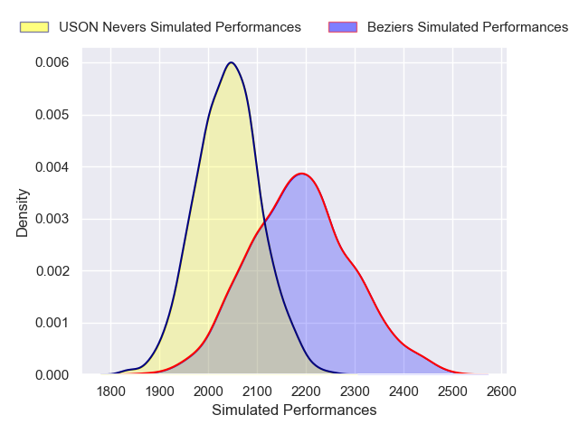
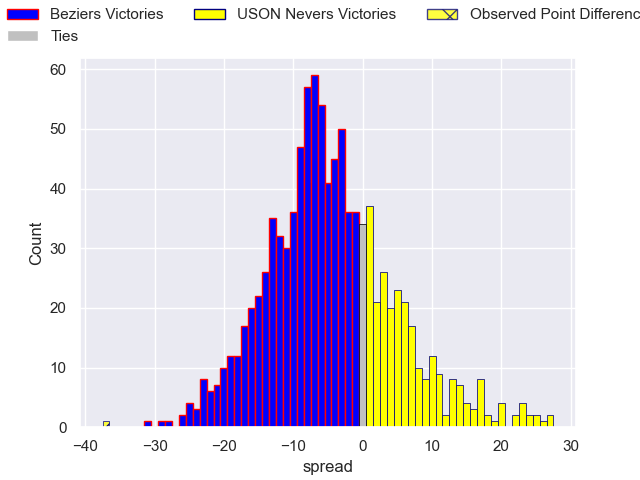
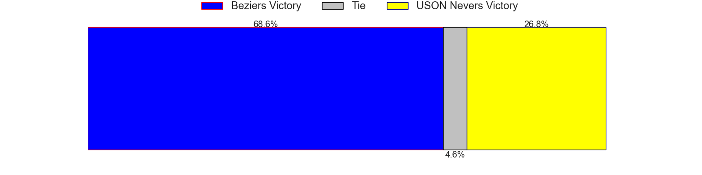

---  
layout: page  
title: Beziers V USON Nevers on 2025/09/05  
date: 2025-09-05  
categories: "Pro D2 25/26" match projection  
---
# Beziers V USON Nevers on 2025/09/05, 49.0 to 12.0

# Club Level Predictions

Now that the game has been played, lets see how the club predictions did. I predicted Beziers to win by 4.62, and Beziers won by 37.0. That's an absolute error of 32.4 for the margin of victory, while my average absolute error has been 14.6 over the past six months. This prediction was more accurate than 8.4% of my recent predictions.

For the Over/Under model, I predicted a total of 55.5 and we have an actual total of 61.0. That's an absolute error of 5.5 compared to a six month average of 13.8. This prediction was more accurate than 74.5% of my recent predictions.
## Projected Performances - Club Model

## Projected Spreads - Club Model

## Projected Results - Club Model

