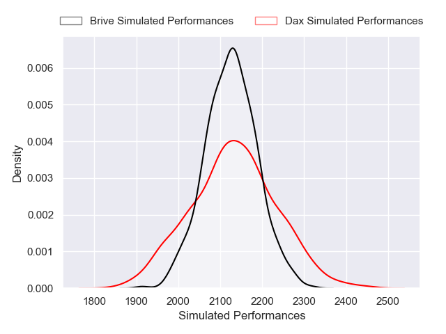
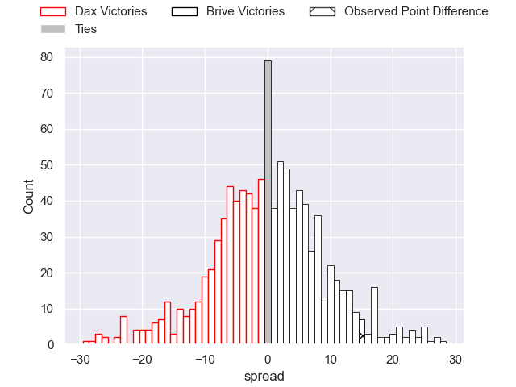

---  
layout: page  
title: Dax V Brive on 2025/09/05  
date: 2025-09-05  
categories: "Pro D2 25/26" match projection  
---
# Dax V Brive on 2025/09/05, 8.0 to 23.0

# Club Level Predictions

Now that the game has been played, lets see how the club predictions did. I predicted Brive to win by 0.11, and Brive won by 15.0. That's an absolute error of 14.9 for the margin of victory, while my average absolute error has been 14.6 over the past six months. This prediction was more accurate than 37.0% of my recent predictions.

For the Over/Under model, I predicted a total of 47.5 and we have an actual total of 31.0. That's an absolute error of 16.5 compared to a six month average of 13.8. This prediction was more accurate than 32.6% of my recent predictions.
## Projected Performances - Club Model

## Projected Spreads - Club Model

## Projected Results - Club Model

