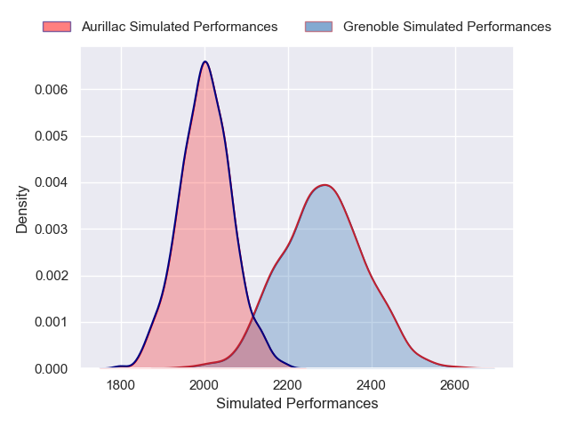
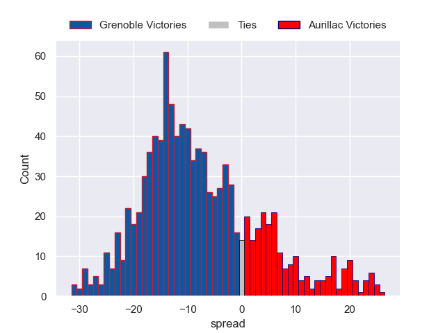
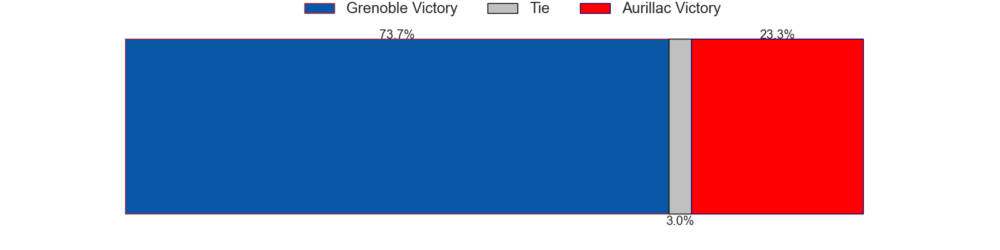

---  
layout: page  
title: Grenoble V Aurillac on 2025/09/05  
date: 2025-09-05  
categories: "Pro D2 25/26" match projection  
---
# Grenoble V Aurillac on 2025/09/05, 38.0 to 16.0

# Club Level Predictions

Now that the game has been played, lets see how the club predictions did. I predicted Grenoble to win by 8.13, and Grenoble won by 22.0. That's an absolute error of 13.9 for the margin of victory, while my average absolute error has been 14.6 over the past six months. This prediction was more accurate than 39.2% of my recent predictions.

For the Over/Under model, I predicted a total of 46.5 and we have an actual total of 54.0. That's an absolute error of 7.5 compared to a six month average of 13.8. This prediction was more accurate than 65.0% of my recent predictions.
## Projected Performances - Club Model

## Projected Spreads - Club Model

## Projected Results - Club Model

