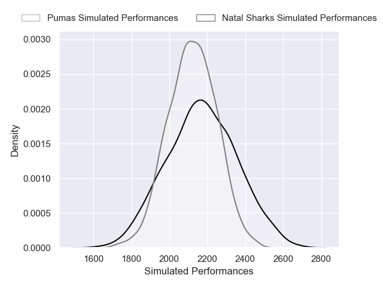
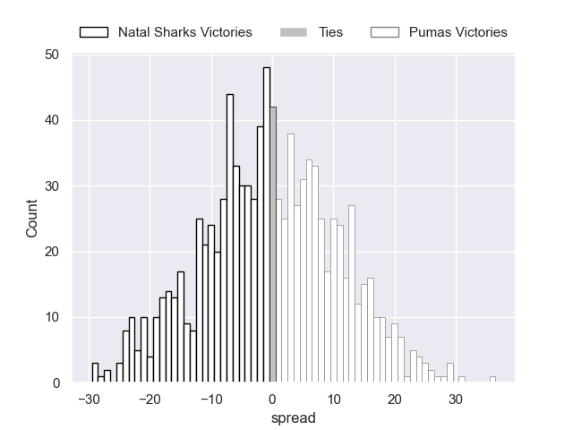

---  
layout: page  
title: Natal Sharks V Pumas on 2025/09/05  
date: 2025-09-05  
categories: "Currie Cup 2025" match projection  
---
# Natal Sharks V Pumas on 2025/09/05, 19.0 to 13.0

# Club Level Predictions

Now that the game has been played, lets see how the club predictions did. I predicted Pumas to win by 2.08, and Natal Sharks won by 6.0. That's an absolute error of 8.1 for the margin of victory, while my average absolute error has been 14.6 over the past six months. This prediction was more accurate than 62.3% of my recent predictions.

For the Over/Under model, I predicted a total of 57.5 and we have an actual total of 32.0. That's an absolute error of 25.5 compared to a six month average of 13.8. This prediction was more accurate than 14.1% of my recent predictions.
## Projected Performances - Club Model

## Projected Spreads - Club Model

## Projected Results - Club Model

