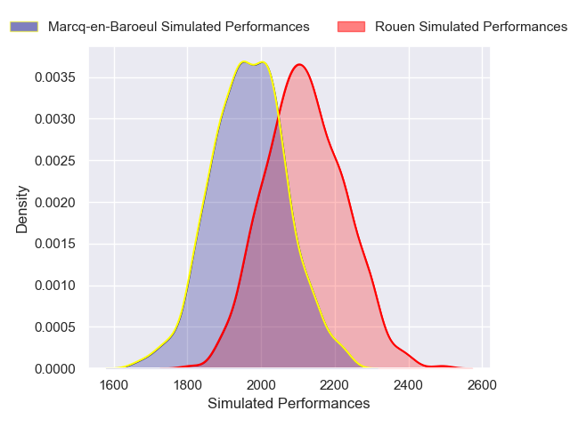
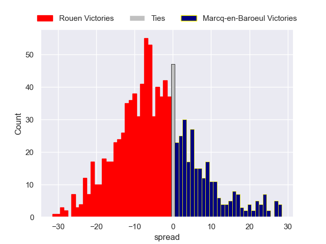

---  
layout: page  
title: Rouen V Marcq-en-Baroeul on 2025/09/05  
date: 2025-09-05  
categories: "Nationale 25/26" match projection  
---
# Rouen V Marcq-en-Baroeul on 2025/09/05, 53.0 to 19.0

# Club Level Predictions

Now that the game has been played, lets see how the club predictions did. I predicted Rouen to win by 4.01, and Rouen won by 34.0. That's an absolute error of 30.0 for the margin of victory, while my average absolute error has been 14.6 over the past six months. This prediction was more accurate than 10.8% of my recent predictions.

For the Over/Under model, I predicted a total of 44.5 and we have an actual total of 72.0. That's an absolute error of 27.5 compared to a six month average of 13.8. This prediction was more accurate than 10.6% of my recent predictions.
## Projected Performances - Club Model

## Projected Spreads - Club Model

## Projected Results - Club Model

