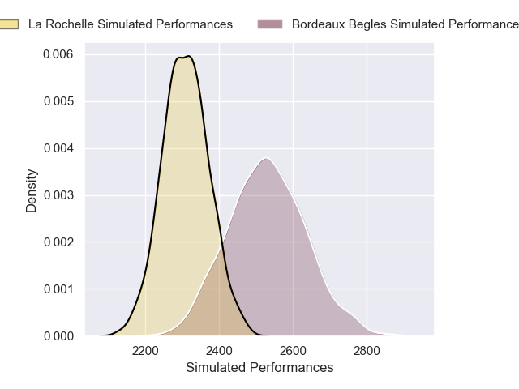
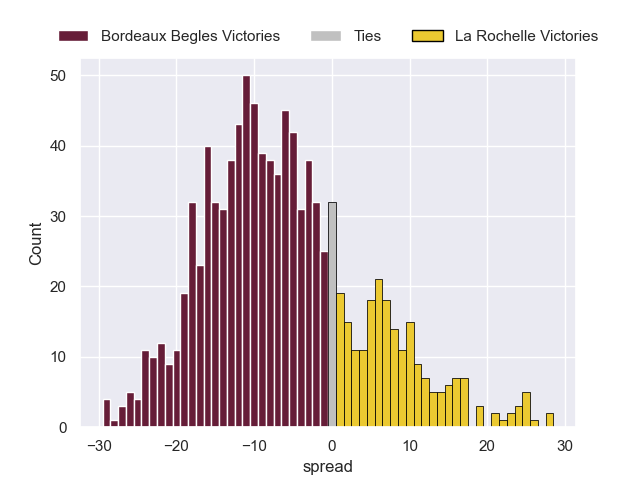

---  
layout: page  
title: Bordeaux Begles V La Rochelle on 2025/09/06  
date: 2025-09-06  
categories: "Top 14 25/26" match projection  
---
# Bordeaux Begles V La Rochelle on 2025/09/06, 23.0 to 18.0

# Club Level Predictions

Now that the game has been played, lets see how the club predictions did. I predicted Bordeaux Begles to win by 6.25, and Bordeaux Begles won by 5.0. That's an absolute error of 1.2 for the margin of victory, while my average absolute error has been 14.6 over the past six months. This prediction was more accurate than 93.8% of my recent predictions.

For the Over/Under model, I predicted a total of 49.5 and we have an actual total of 41.0. That's an absolute error of 8.5 compared to a six month average of 13.8. This prediction was more accurate than 61.2% of my recent predictions.
## Projected Performances - Club Model

## Projected Spreads - Club Model

## Projected Results - Club Model

