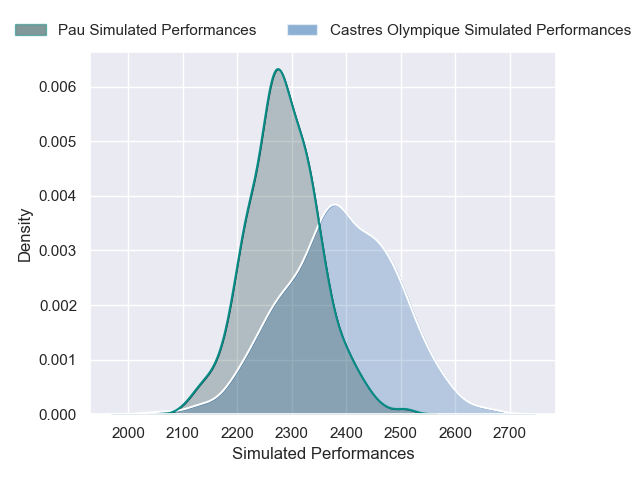
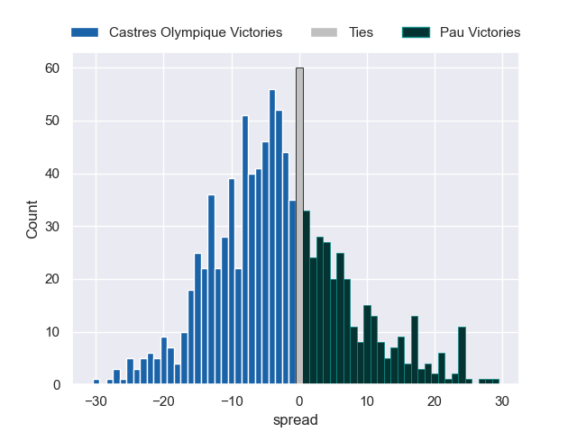

---  
layout: page  
title: Castres Olympique V Pau on 2025/09/06  
date: 2025-09-06  
categories: "Top 14 25/26" match projection  
---
# Castres Olympique V Pau on 2025/09/06, 15.0 to 17.0

# Club Level Predictions

Now that the game has been played, lets see how the club predictions did. I predicted Castres Olympique to win by 2.82, and Pau won by 2.0. That's an absolute error of 4.8 for the margin of victory, while my average absolute error has been 14.6 over the past six months. This prediction was more accurate than 77.2% of my recent predictions.

For the Over/Under model, I predicted a total of 50.5 and we have an actual total of 32.0. That's an absolute error of 18.5 compared to a six month average of 13.8. This prediction was more accurate than 27.0% of my recent predictions.
## Projected Performances - Club Model

## Projected Spreads - Club Model

## Projected Results - Club Model

