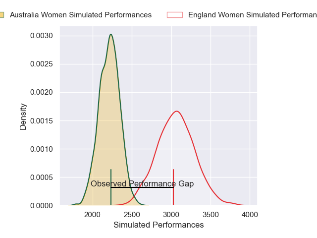
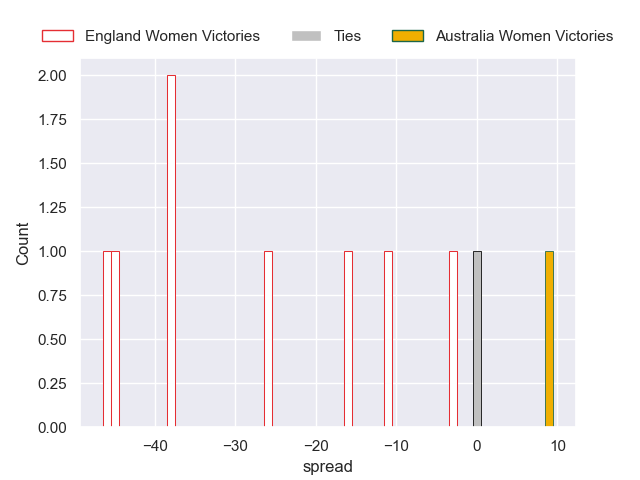

---  
layout: page  
title: England Women V Australia Women on 2025/09/06  
date: 2025-09-06  
categories: "Women's Rugby World Cup 2025" match projection  
---
# England Women V Australia Women on 2025/09/06, 47.0 to 7.0

# Club Level Predictions

Now that the game has been played, lets see how the club predictions did. I predicted England Women to win by 22.63, and England Women won by 40.0. That's an absolute error of 17.4 for the margin of victory, while my average absolute error has been 14.6 over the past six months. This prediction was more accurate than 30.1% of my recent predictions.

For the Over/Under model, I predicted a total of 59.5 and we have an actual total of 54.0. That's an absolute error of 5.5 compared to a six month average of 13.8. This prediction was more accurate than 74.5% of my recent predictions.
## Projected Performances - Club Model

## Projected Spreads - Club Model

## Projected Results - Club Model

