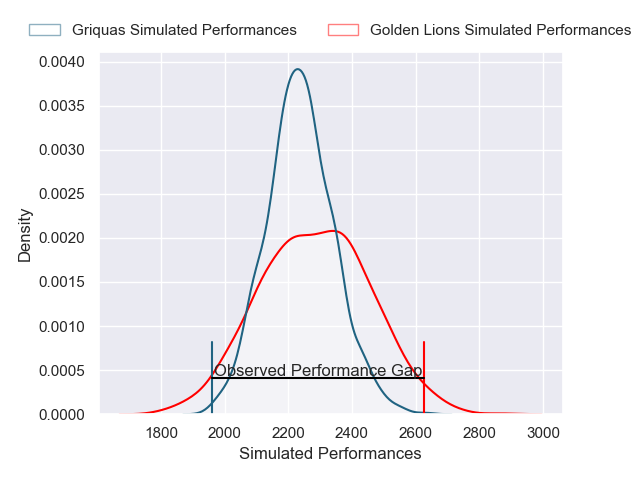
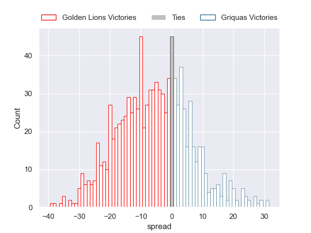
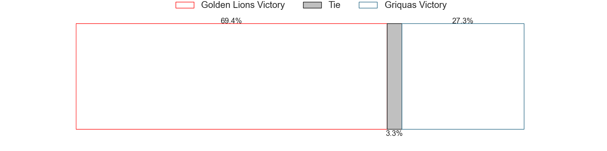

---  
layout: page  
title: Golden Lions V Griquas on 2025/09/06  
date: 2025-09-06  
categories: "Currie Cup 2025" match projection  
---
# Golden Lions V Griquas on 2025/09/06, 37.0 to 7.0

# Club Level Predictions

Now that the game has been played, lets see how the club predictions did. I predicted Golden Lions to win by 1.55, and Golden Lions won by 30.0. That's an absolute error of 28.4 for the margin of victory, while my average absolute error has been 14.6 over the past six months. This prediction was more accurate than 12.1% of my recent predictions.

For the Over/Under model, I predicted a total of 57.5 and we have an actual total of 44.0. That's an absolute error of 13.5 compared to a six month average of 13.8. This prediction was more accurate than 40.9% of my recent predictions.
## Projected Performances - Club Model

## Projected Spreads - Club Model

## Projected Results - Club Model

