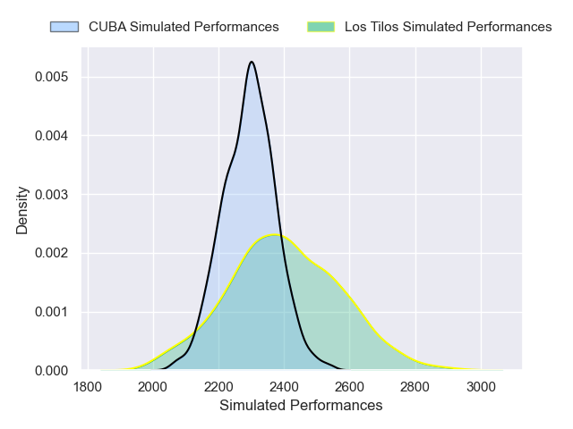
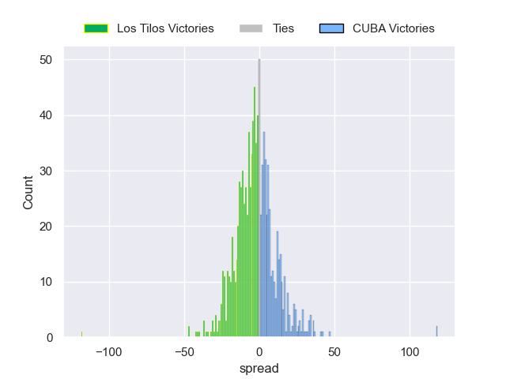

---  
layout: page  
title: Los Tilos V CUBA on 2025/09/06  
date: 2025-09-06  
categories: "URBA Top 13 2025" match projection  
---
# Los Tilos V CUBA on 2025/09/06, 35.0 to 34.0

# Club Level Predictions

Now that the game has been played, lets see how the club predictions did. I predicted Los Tilos to win by 3.16, and Los Tilos won by 1.0. That's an absolute error of 2.2 for the margin of victory, while my average absolute error has been 14.6 over the past six months. This prediction was more accurate than 89.1% of my recent predictions.

For the Over/Under model, I predicted a total of 51.5 and we have an actual total of 69.0. That's an absolute error of 17.5 compared to a six month average of 13.8. This prediction was more accurate than 30.2% of my recent predictions.
## Projected Performances - Club Model

## Projected Spreads - Club Model

## Projected Results - Club Model

