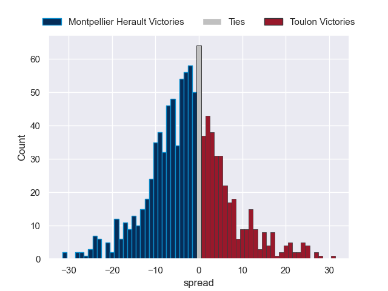

---  
layout: page  
title: Montpellier Herault V Toulon on 2025/09/06  
date: 2025-09-06  
categories: "Top 14 25/26" match projection  
---
# Montpellier Herault V Toulon on 2025/09/06, 17.0 to 27.0

# Club Level Predictions

Now that the game has been played, lets see how the club predictions did. I predicted Montpellier Herault to win by 1.9, and Toulon won by 10.0. That's an absolute error of 11.9 for the margin of victory, while my average absolute error has been 14.6 over the past six months. This prediction was more accurate than 47.0% of my recent predictions.

For the Over/Under model, I predicted a total of 49.5 and we have an actual total of 44.0. That's an absolute error of 5.5 compared to a six month average of 13.8. This prediction was more accurate than 74.5% of my recent predictions.
## Projected Performances - Club Model

## Projected Spreads - Club Model

## Projected Results - Club Model

