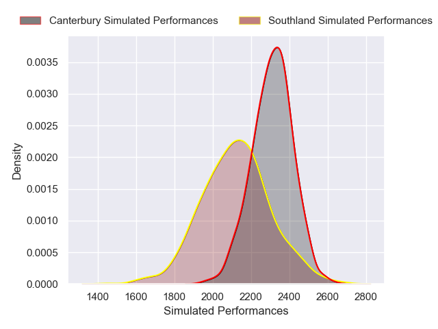
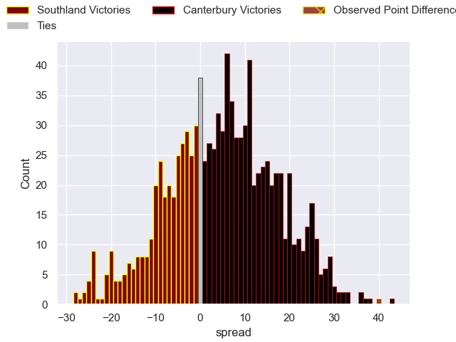

---  
layout: page  
title: Southland V Canterbury on 2025/09/06  
date: 2025-09-06  
categories: "NPC 2025" match projection  
---
# Southland V Canterbury on 2025/09/06, 14.0 to 54.0

# Club Level Predictions

Now that the game has been played, lets see how the club predictions did. I predicted Canterbury to win by 5.55, and Canterbury won by 40.0. That's an absolute error of 34.4 for the margin of victory, while my average absolute error has been 14.6 over the past six months. This prediction was more accurate than 8.0% of my recent predictions.

For the Over/Under model, I predicted a total of 54.5 and we have an actual total of 68.0. That's an absolute error of 13.5 compared to a six month average of 13.8. This prediction was more accurate than 40.9% of my recent predictions.
## Projected Performances - Club Model

## Projected Spreads - Club Model

## Projected Results - Club Model

