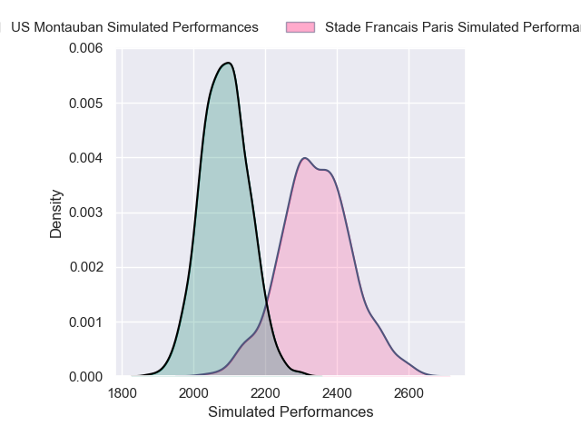
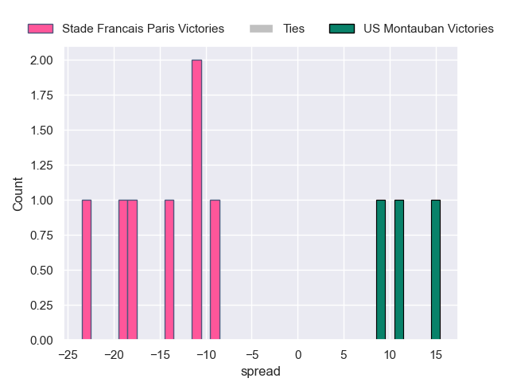

---  
layout: page  
title: Stade Francais Paris V US Montauban on 2025/09/06  
date: 2025-09-06  
categories: "Top 14 25/26" match projection  
---
# Stade Francais Paris V US Montauban on 2025/09/06, 47.0 to 24.0

# Club Level Predictions

Now that the game has been played, lets see how the club predictions did. I predicted Stade Francais Paris to win by 7.43, and Stade Francais Paris won by 23.0. That's an absolute error of 15.6 for the margin of victory, while my average absolute error has been 14.6 over the past six months. This prediction was more accurate than 35.1% of my recent predictions.

For the Over/Under model, I predicted a total of 46.5 and we have an actual total of 71.0. That's an absolute error of 24.5 compared to a six month average of 13.8. This prediction was more accurate than 16.3% of my recent predictions.
## Projected Performances - Club Model

## Projected Spreads - Club Model

## Projected Results - Club Model

