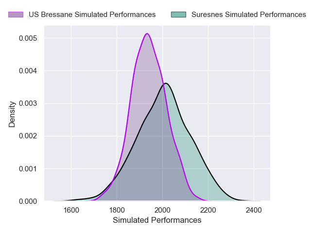
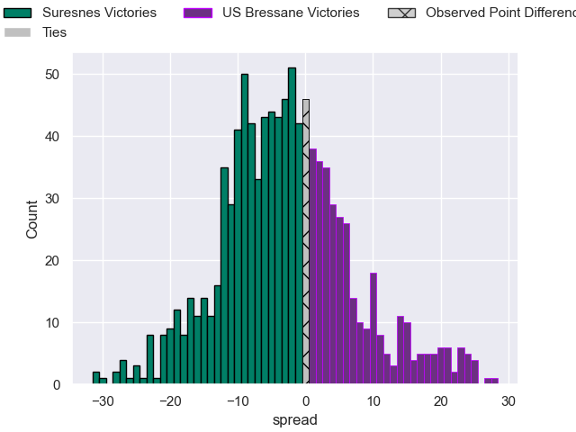

---  
layout: page  
title: Suresnes V US Bressane on 2025/09/06  
date: 2025-09-06  
categories: "Nationale 25/26" match projection  
---
# Suresnes V US Bressane on 2025/09/06, 32.0 to 32.0

# Club Level Predictions

Now that the game has been played, lets see how the club predictions did. I predicted Suresnes to win by 3.05, and US Bressane won by 0.0. That's an absolute error of 3.0 for the margin of victory, while my average absolute error has been 14.6 over the past six months. This prediction was more accurate than 85.8% of my recent predictions.

For the Over/Under model, I predicted a total of 43.5 and we have an actual total of 64.0. That's an absolute error of 20.5 compared to a six month average of 13.8. This prediction was more accurate than 23.0% of my recent predictions.
## Projected Performances - Club Model

## Projected Spreads - Club Model

## Projected Results - Club Model

