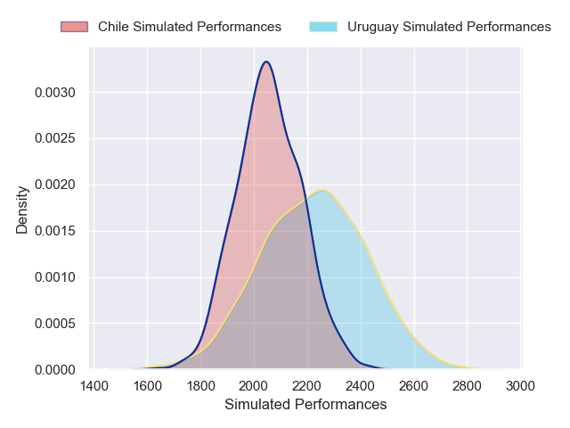
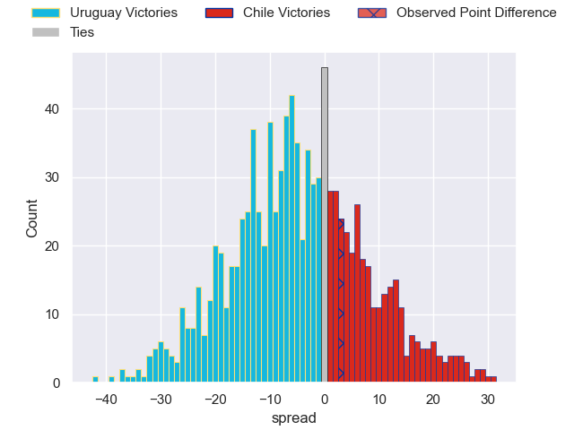

---  
layout: page  
title: Uruguay V Chile on 2025/09/06  
date: 2025-09-06  
categories: "International Test Match 2025" match projection  
---
# Uruguay V Chile on 2025/09/06, 18.0 to 21.0

# Club Level Predictions

Now that the game has been played, lets see how the club predictions did. I predicted Uruguay to win by 5.4, and Chile won by 3.0. That's an absolute error of 8.4 for the margin of victory, while my average absolute error has been 14.6 over the past six months. This prediction was more accurate than 60.1% of my recent predictions.

For the Over/Under model, I predicted a total of 51.5 and we have an actual total of 39.0. That's an absolute error of 12.5 compared to a six month average of 13.8. This prediction was more accurate than 44.5% of my recent predictions.
## Projected Performances - Club Model

## Projected Spreads - Club Model

## Projected Results - Club Model

