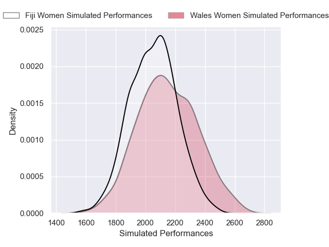
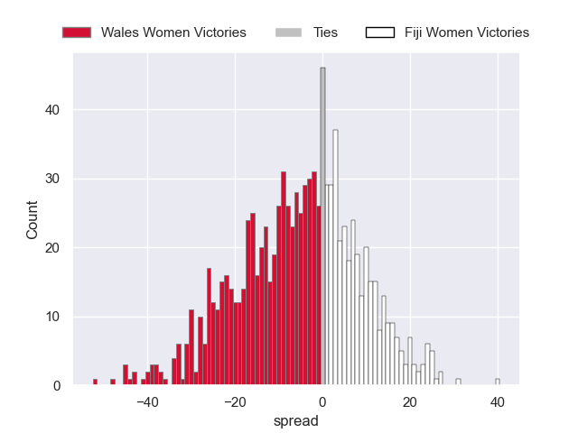

---  
layout: page  
title: Wales Women V Fiji Women on 2025/09/06  
date: 2025-09-06  
categories: "Women's Rugby World Cup 2025" match projection  
---
# Wales Women V Fiji Women on 2025/09/06, 25.0 to 28.0

# Club Level Predictions

Now that the game has been played, lets see how the club predictions did. I predicted Wales Women to win by 2.49, and Fiji Women won by 3.0. That's an absolute error of 5.5 for the margin of victory, while my average absolute error has been 14.6 over the past six months. This prediction was more accurate than 73.9% of my recent predictions.

For the Over/Under model, I predicted a total of 51.5 and we have an actual total of 53.0. That's an absolute error of 1.5 compared to a six month average of 13.8. This prediction was more accurate than 92.7% of my recent predictions.
## Projected Performances - Club Model

## Projected Spreads - Club Model

## Projected Results - Club Model

