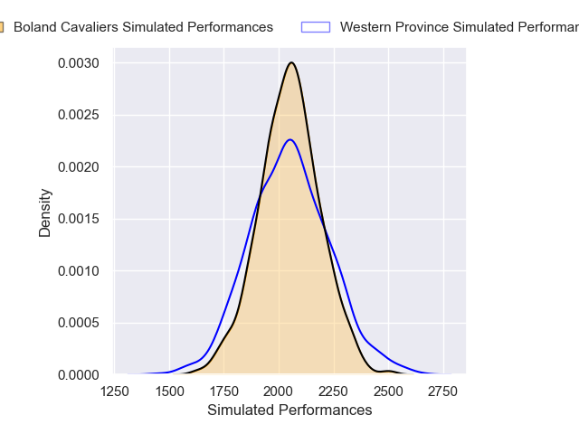
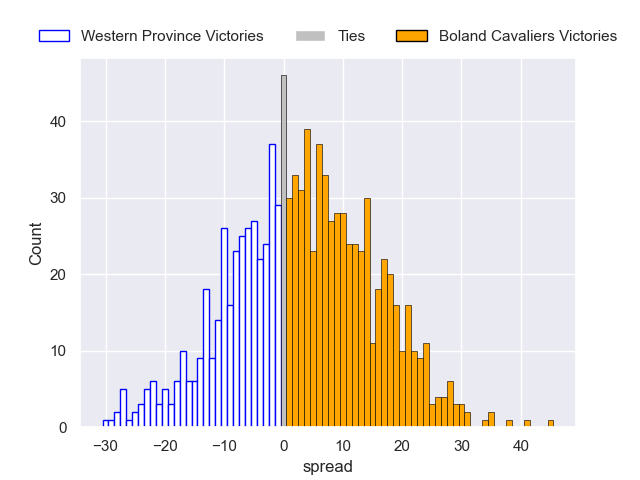

---  
layout: page  
title: Western Province V Boland Cavaliers on 2025/09/06  
date: 2025-09-06  
categories: "Currie Cup 2025" match projection  
---
# Western Province V Boland Cavaliers on 2025/09/06, 40.0 to 22.0

# Club Level Predictions

Now that the game has been played, lets see how the club predictions did. I predicted Boland Cavaliers to win by 5.79, and Western Province won by 18.0. That's an absolute error of 23.8 for the margin of victory, while my average absolute error has been 14.6 over the past six months. This prediction was more accurate than 17.9% of my recent predictions.

For the Over/Under model, I predicted a total of 58.5 and we have an actual total of 62.0. That's an absolute error of 3.5 compared to a six month average of 13.8. This prediction was more accurate than 83.6% of my recent predictions.
## Projected Performances - Club Model

## Projected Spreads - Club Model

## Projected Results - Club Model

