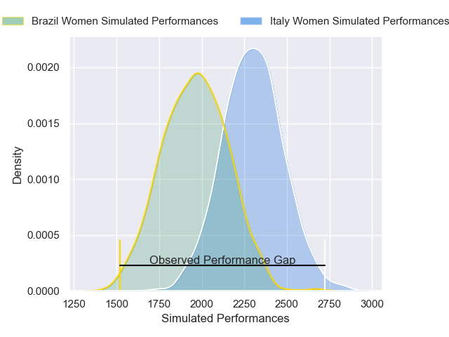
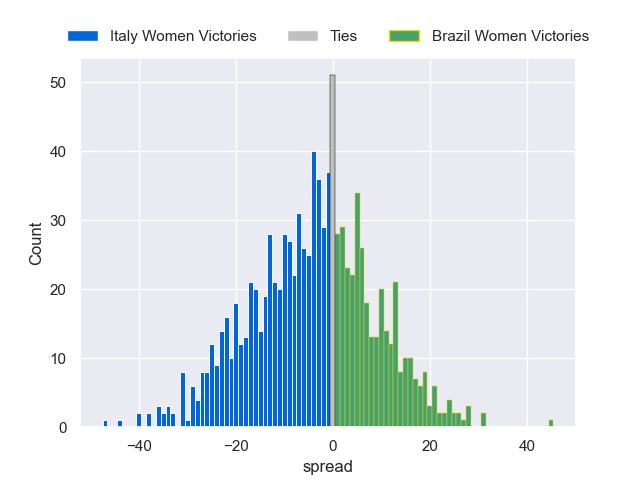

---  
layout: page  
title: Italy Women V Brazil Women on 2025/09/07  
date: 2025-09-07  
categories: "Women's Rugby World Cup 2025" match projection  
---
# Italy Women V Brazil Women on 2025/09/07, 64.0 to 3.0

# Club Level Predictions

Now that the game has been played, lets see how the club predictions did. I predicted Italy Women to win by 8.36, and Italy Women won by 61.0. That's an absolute error of 52.6 for the margin of victory, while my average absolute error has been 14.6 over the past six months. This prediction was more accurate than 2.4% of my recent predictions.

For the Over/Under model, I predicted a total of 57.5 and we have an actual total of 67.0. That's an absolute error of 9.5 compared to a six month average of 13.8. This prediction was more accurate than 57.5% of my recent predictions.
## Projected Performances - Club Model

## Projected Spreads - Club Model

## Projected Results - Club Model

