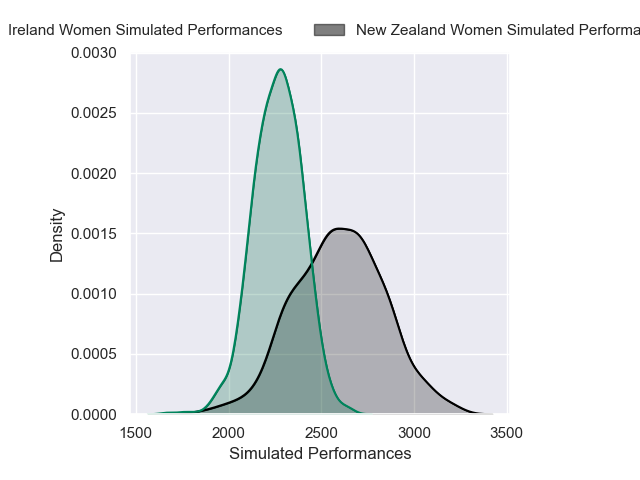
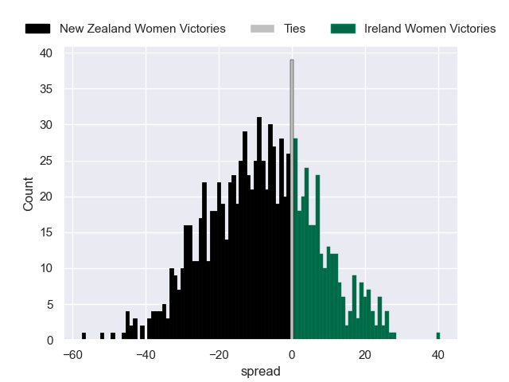

---  
layout: page  
title: New Zealand Women V Ireland Women on 2025/09/07  
date: 2025-09-07  
categories: "Women's Rugby World Cup 2025" match projection  
---
# New Zealand Women V Ireland Women on 2025/09/07, 40.0 to 0.0

# Club Level Predictions

Now that the game has been played, lets see how the club predictions did. I predicted New Zealand Women to win by 11.29, and New Zealand Women won by 40.0. That's an absolute error of 28.7 for the margin of victory, while my average absolute error has been 14.6 over the past six months. This prediction was more accurate than 11.9% of my recent predictions.

For the Over/Under model, I predicted a total of 56.5 and we have an actual total of 40.0. That's an absolute error of 16.5 compared to a six month average of 13.8. This prediction was more accurate than 32.6% of my recent predictions.
## Projected Performances - Club Model

## Projected Spreads - Club Model

## Projected Results - Club Model

