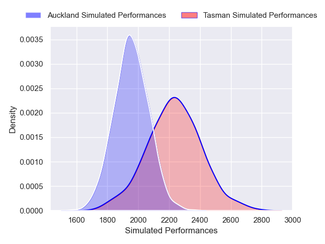
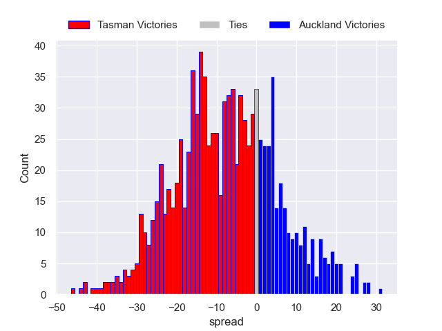

---  
layout: page  
title: Tasman V Auckland on 2025/09/07  
date: 2025-09-07  
categories: "NPC 2025" match projection  
---
# Tasman V Auckland on 2025/09/07, 21.0 to 29.0

# Club Level Predictions

Now that the game has been played, lets see how the club predictions did. I predicted Tasman to win by 7.99, and Auckland won by 8.0. That's an absolute error of 16.0 for the margin of victory, while my average absolute error has been 14.6 over the past six months. This prediction was more accurate than 34.0% of my recent predictions.

For the Over/Under model, I predicted a total of 52.5 and we have an actual total of 50.0. That's an absolute error of 2.5 compared to a six month average of 13.8. This prediction was more accurate than 88.0% of my recent predictions.
## Projected Performances - Club Model

## Projected Spreads - Club Model

## Projected Results - Club Model

