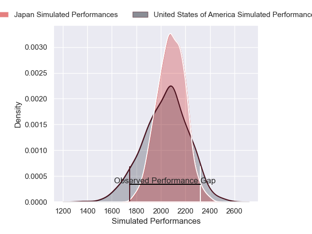
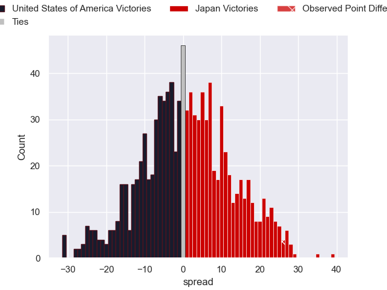

---  
layout: page  
title: United States of America V Japan on 2025/09/07  
date: 2025-09-07  
categories: "Pacific Nations Cup 2025" match projection  
---
# United States of America V Japan on 2025/09/07, 21.0 to 47.0

# Club Level Predictions

Now that the game has been played, lets see how the club predictions did. I predicted Japan to win by 1.12, and Japan won by 26.0. That's an absolute error of 24.9 for the margin of victory, while my average absolute error has been 14.6 over the past six months. This prediction was more accurate than 16.7% of my recent predictions.

For the Over/Under model, I predicted a total of 55.5 and we have an actual total of 68.0. That's an absolute error of 12.5 compared to a six month average of 13.8. This prediction was more accurate than 45.4% of my recent predictions.
## Projected Performances - Club Model

## Projected Spreads - Club Model

## Projected Results - Club Model

