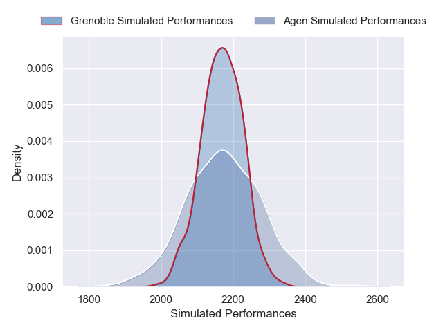
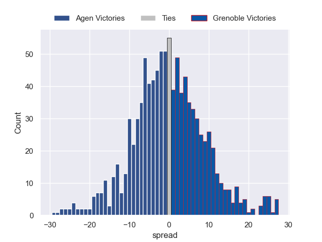

---  
layout: page  
title: Agen V Grenoble on 2025/09/11  
date: 2025-09-11  
categories: "Pro D2 25/26" match projection  
---
# Agen V Grenoble on 2025/09/11, 38.0 to 20.0

# Club Level Predictions

Now that the game has been played, lets see how the club predictions did. I predicted Grenoble to win by 0.5, and Agen won by 18.0. That's an absolute error of 18.5 for the margin of victory, while my average absolute error has been 14.5 over the past six months. This prediction was more accurate than 27.7% of my recent predictions.

For the Over/Under model, I predicted a total of 49.5 and we have an actual total of 58.0. That's an absolute error of 8.5 compared to a six month average of 13.6. This prediction was more accurate than 61.8% of my recent predictions.
## Projected Performances - Club Model

## Projected Spreads - Club Model

## Projected Results - Club Model

