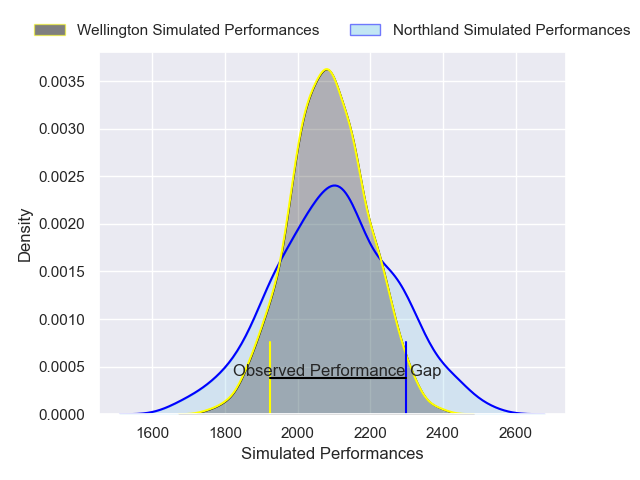
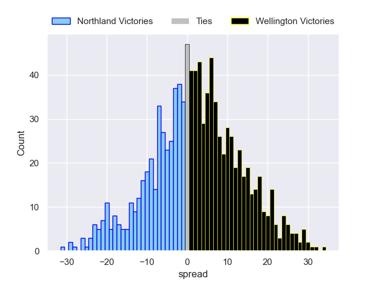

---  
layout: page  
title: Northland V Wellington on 2025/09/11  
date: 2025-09-11  
categories: "NPC 2025" match projection  
---
# Northland V Wellington on 2025/09/11, 43.0 to 26.0

# Club Level Predictions

Now that the game has been played, lets see how the club predictions did. I predicted Northland to win by 0.9, and Northland won by 17.0. That's an absolute error of 16.1 for the margin of victory, while my average absolute error has been 14.6 over the past six months. This prediction was more accurate than 33.3% of my recent predictions.

For the Over/Under model, I predicted a total of 58.5 and we have an actual total of 69.0. That's an absolute error of 10.5 compared to a six month average of 13.7. This prediction was more accurate than 52.8% of my recent predictions.
## Projected Performances - Club Model

## Projected Spreads - Club Model

## Projected Results - Club Model

