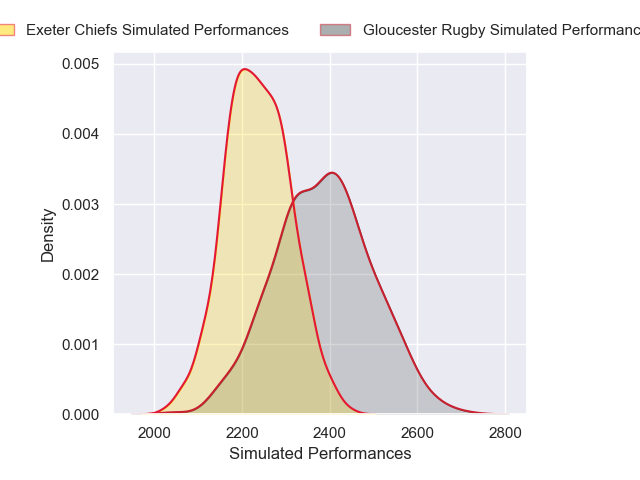
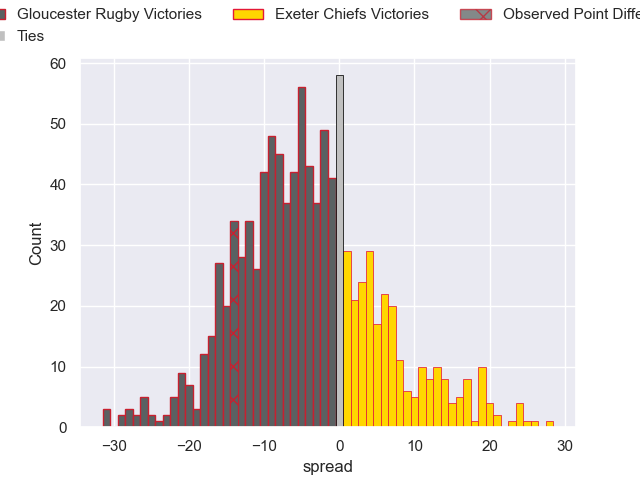

---  
layout: page  
title: Gloucester Rugby V Exeter Chiefs on 2025/09/12  
date: 2025-09-12  
categories: "Premiership Rugby Cup 25/26" match projection  
---
# Gloucester Rugby V Exeter Chiefs on 2025/09/12, 29.0 to 15.0

# Club Level Predictions

Now that the game has been played, lets see how the club predictions did. I predicted Gloucester Rugby to win by 4.16, and Gloucester Rugby won by 14.0. That's an absolute error of 9.8 for the margin of victory, while my average absolute error has been 14.5 over the past six months. This prediction was more accurate than 52.9% of my recent predictions.

For the Over/Under model, I predicted a total of 54.5 and we have an actual total of 44.0. That's an absolute error of 10.5 compared to a six month average of 13.6. This prediction was more accurate than 52.0% of my recent predictions.
## Projected Performances - Club Model

## Projected Spreads - Club Model

## Projected Results - Club Model

