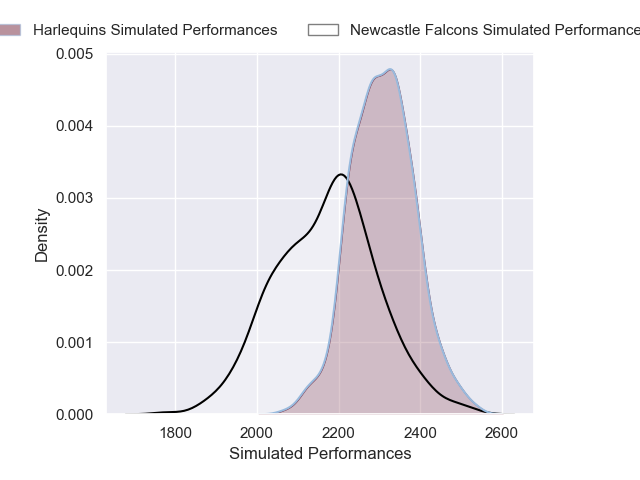
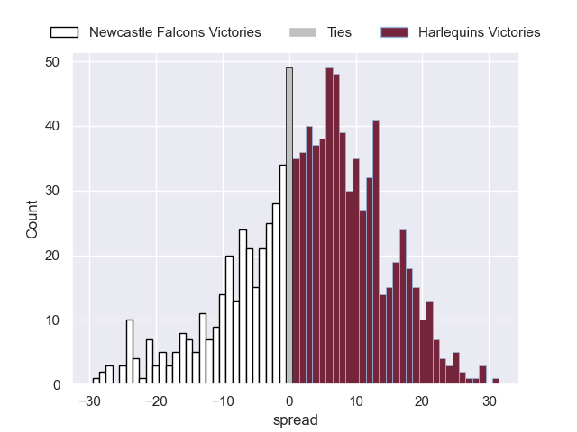

---  
layout: page  
title: Newcastle Falcons V Harlequins on 2025/09/12  
date: 2025-09-12  
categories: "Premiership Rugby Cup 25/26" match projection  
---
# Newcastle Falcons V Harlequins on 2025/09/12, 26.0 to 14.0

# Club Level Predictions

Now that the game has been played, lets see how the club predictions did. I predicted Harlequins to win by 4.72, and Newcastle Falcons won by 12.0. That's an absolute error of 16.7 for the margin of victory, while my average absolute error has been 14.6 over the past six months. This prediction was more accurate than 32.1% of my recent predictions.

For the Over/Under model, I predicted a total of 63.5 and we have an actual total of 40.0. That's an absolute error of 23.5 compared to a six month average of 13.7. This prediction was more accurate than 17.1% of my recent predictions.
## Projected Performances - Club Model

## Projected Spreads - Club Model

## Projected Results - Club Model

