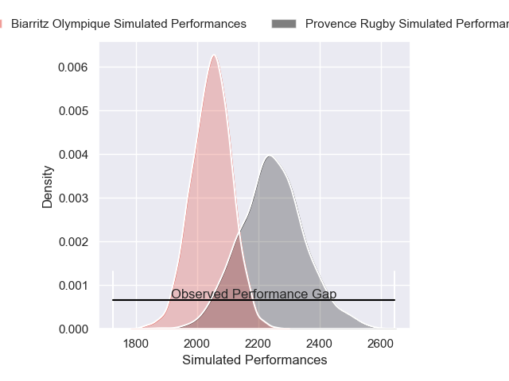
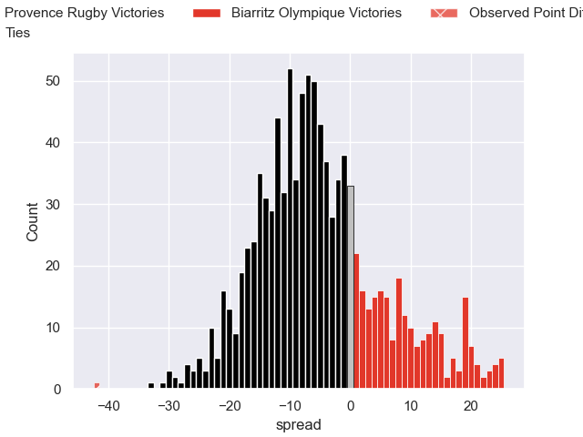

---  
layout: page  
title: Provence Rugby V Biarritz Olympique on 2025/09/12  
date: 2025-09-12  
categories: "Pro D2 25/26" match projection  
---
# Provence Rugby V Biarritz Olympique on 2025/09/12, 52.0 to 10.0

# Club Level Predictions

Now that the game has been played, lets see how the club predictions did. I predicted Provence Rugby to win by 6.35, and Provence Rugby won by 42.0. That's an absolute error of 35.6 for the margin of victory, while my average absolute error has been 14.6 over the past six months. This prediction was more accurate than 7.2% of my recent predictions.

For the Over/Under model, I predicted a total of 52.5 and we have an actual total of 62.0. That's an absolute error of 9.5 compared to a six month average of 13.7. This prediction was more accurate than 57.4% of my recent predictions.
## Projected Performances - Club Model

## Projected Spreads - Club Model

## Projected Results - Club Model

