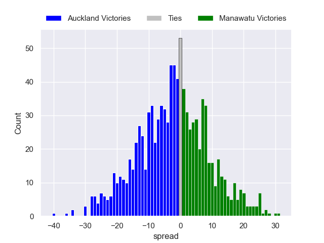

---  
layout: page  
title: Auckland V Manawatu on 2025/09/13  
date: 2025-09-13  
categories: "NPC 2025" match projection  
---
# Auckland V Manawatu on 2025/09/13, 52.0 to 29.0

# Club Level Predictions

Now that the game has been played, lets see how the club predictions did. I predicted Auckland to win by 3.15, and Auckland won by 23.0. That's an absolute error of 19.8 for the margin of victory, while my average absolute error has been 14.6 over the past six months. This prediction was more accurate than 25.2% of my recent predictions.

For the Over/Under model, I predicted a total of 61.5 and we have an actual total of 81.0. That's an absolute error of 19.5 compared to a six month average of 13.7. This prediction was more accurate than 24.3% of my recent predictions.
## Projected Performances - Club Model

## Projected Spreads - Club Model

## Projected Results - Club Model

