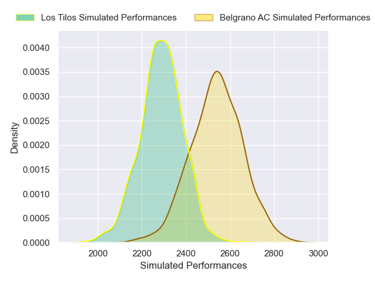
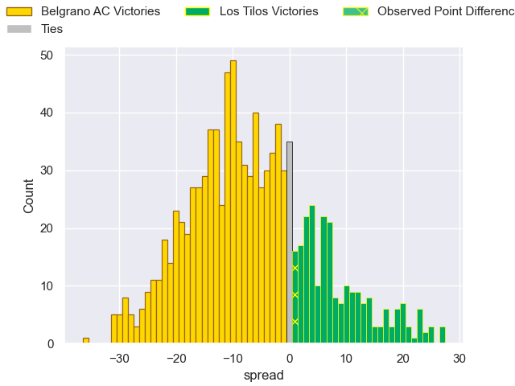

---  
layout: page  
title: Belgrano AC V Los Tilos on 2025/09/13  
date: 2025-09-13  
categories: "URBA Top 13 2025" match projection  
---
# Belgrano AC V Los Tilos on 2025/09/13, 31.0 to 32.0

# Club Level Predictions

Now that the game has been played, lets see how the club predictions did. I predicted Belgrano AC to win by 6.56, and Los Tilos won by 1.0. That's an absolute error of 7.6 for the margin of victory, while my average absolute error has been 14.6 over the past six months. This prediction was more accurate than 65.2% of my recent predictions.

For the Over/Under model, I predicted a total of 52.5 and we have an actual total of 63.0. That's an absolute error of 10.5 compared to a six month average of 13.7. This prediction was more accurate than 52.8% of my recent predictions.
## Projected Performances - Club Model

## Projected Spreads - Club Model

## Projected Results - Club Model

